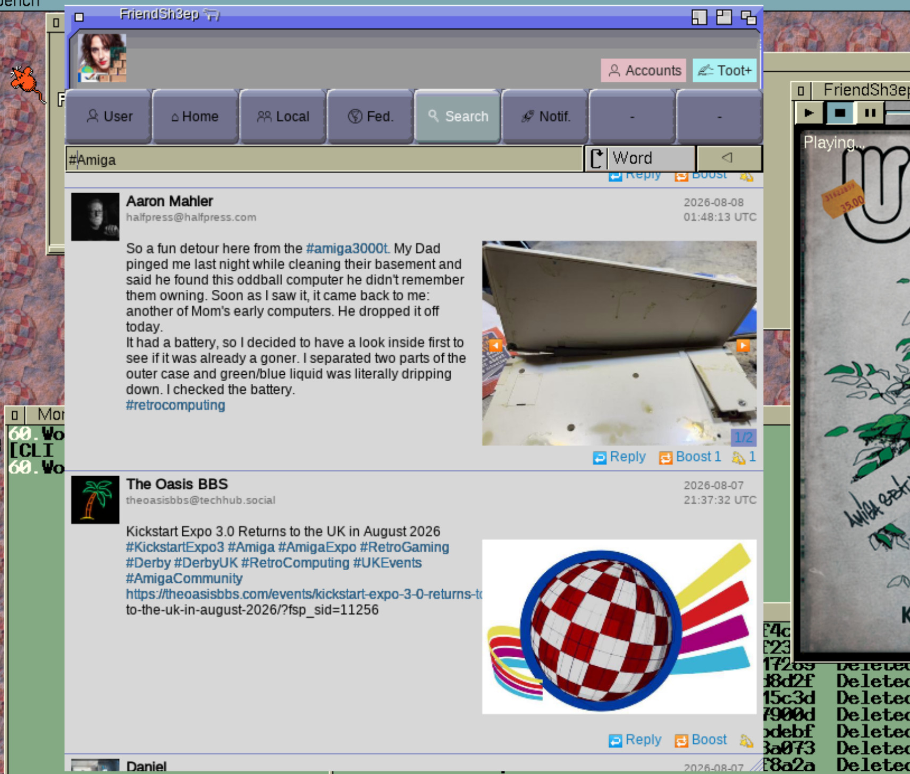
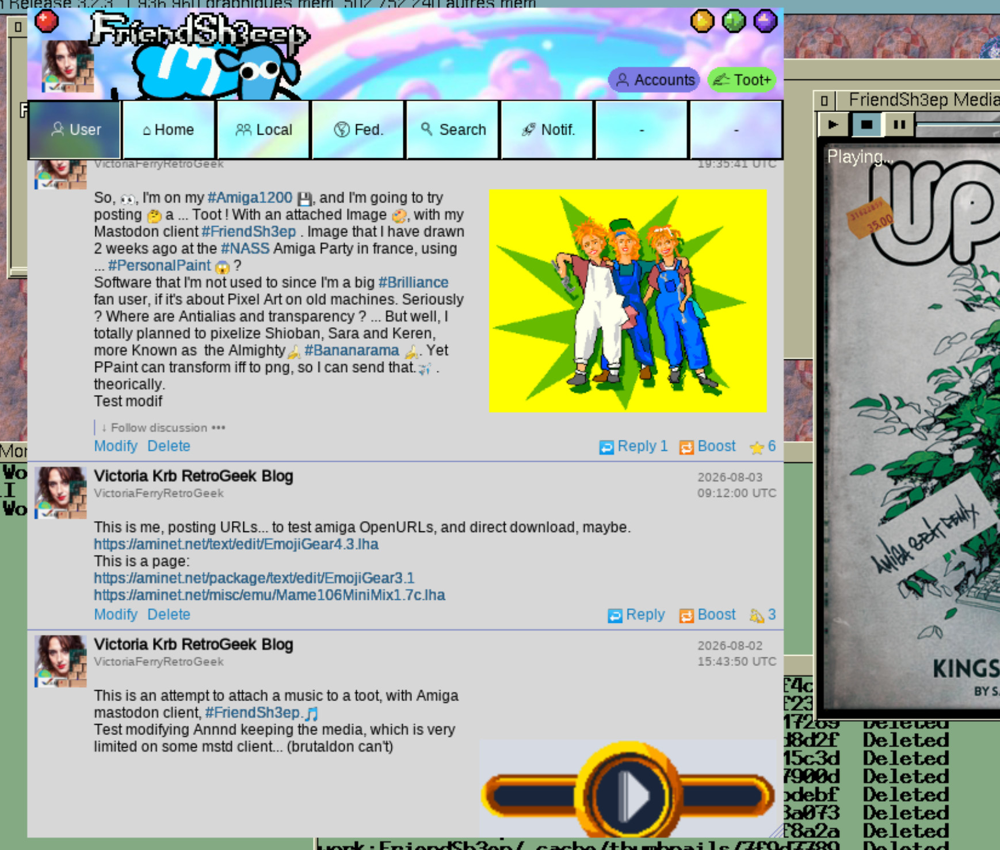

# FriendSh3ep

Amiga OS3 Mastodon Client

------------------------- Version 0.8

 First public beta of FriendSh3ep, a Mastodon/Fediverse client for AmigaOS3.

 Mastodon is a free, open, decentralised alternative to the usual walled-garden
 social networks: no ads, no biased algorithm, no single company owning your
 data, moderation decided per server. FriendSh3ep is a native Amiga client for
 it, with full Unicode/emoji rendering and real image/audio previews.

 Needed to work:

  - AmigaOS 3.2, a 68030 should be OK, a 68060 or better is, well, better.
    (OS3.9/Coffin/AmiKit users: just upgrade to OS3.2.)
  - An Internet stack (Miami, AmiTCP, RoadShow...).
  - AmiSSL v5 (the more recent, the better) -- it's on Aminet.
  - EmojiGear v5.1, for modern font and emoji rendering.

 Optional:

  - AHI + mpega.library, for mp3 audio playback (yes, you can share mp3s
    on Mastodon).

 As with any third-party Mastodon client, you create your account on your
 server's own web site; FriendSh3ep only ever gets a revocable token to it,
 authorised in your browser in two steps. You can connect several accounts,
 on several servers, and switch between them with one click -- or just
 browse anonymously without any account at all.

 What this beta can do:

  - Connect multiple accounts, or browse anonymously.
  - Home, Local, Federated, User, Search and Notifications timelines.
  - Full toot rendering with attached images, audio and emoji.
  - Click hashtags, links and mentions -- actually click anything.
  - Favourite/unfavourite, reply, modify and delete your own toots.
  - Attach an image or audio/video file to a toot (gif/jpg/png, mp3/ogg/mp4).
  - Word and hashtag search; search, follow and unfollow accounts.
  - "Autoscroll Play" mode: sit back and let the timeline scroll itself.
  - Switchable UI themes (fonts, colours, button skins).

 Not yet there, but coming:

  - Block/unblock accounts and whole servers.
  - Bookmarks and a "News" (most-shared) timeline.
  - Attaching more than one file per toot.
  - Polls.

 Not planned at all (but who knows):

  - Playing attached videos in place (you get a thumbnail for them).
  - WebP images, until a webp picture.datatype shows up somewhere.

--------------------------

FriendSh3ep is a Mastodon/Fediverse client for AmigaOS 3.2.x (68k), built on
the same UTF-8/emoji rendering stack as EmojiGear (utf8rastport.library,
unitexteditor.gadget, unibutton.gadget).

License is GPL.

---------------------------------------------------------------------------

SOURCE CODE AND BUG REPORTS

Source code:
  https://github.com/krabobmkd/FriendSh3ep

Bug reports and feature requests:
  https://github.com/krabobmkd/FriendSh3ep/issues

---------------------------------------------------------------------------
